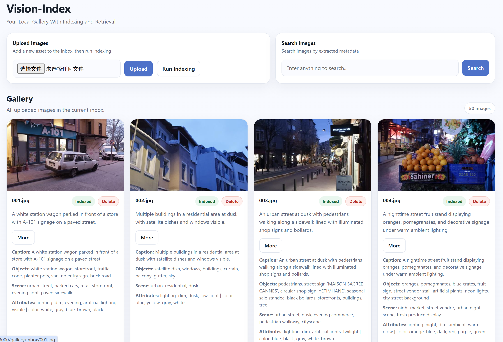
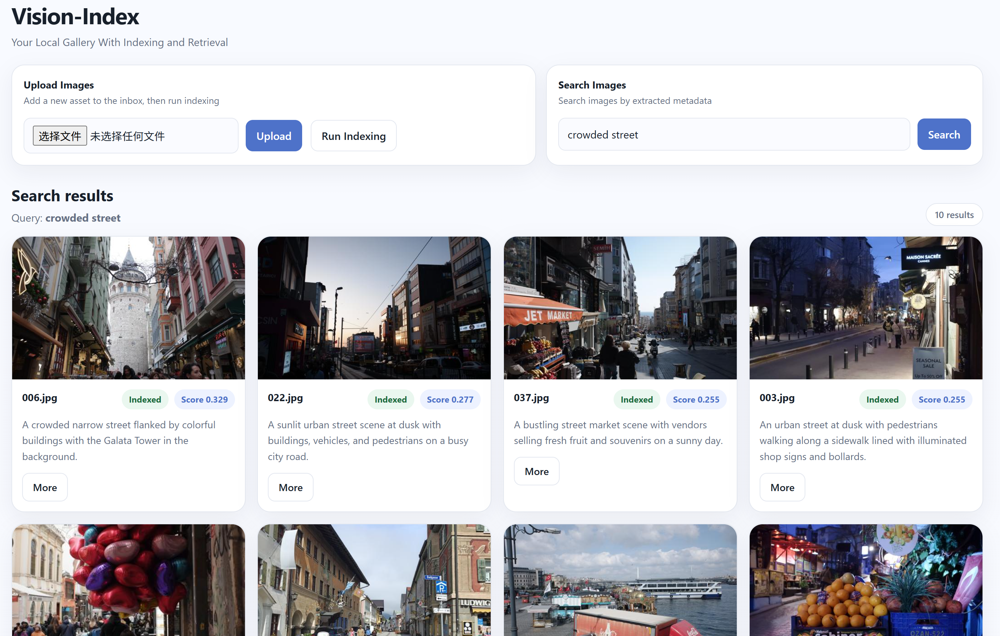
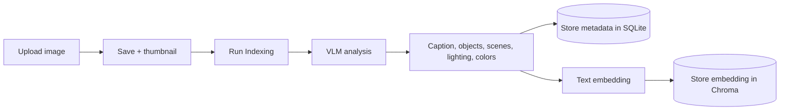
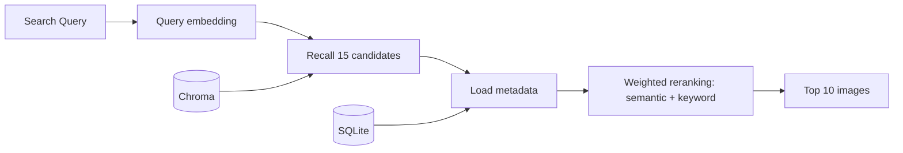

# Vision-Index
**Local-first multimodal image indexing and semantic retrieval system.**

## Introduction

Vision-Index lets users upload images and search them with natural-language queries. It combines local VLM-based image understanding, text embeddings, vector retrieval, and two-stage search with reranking, all accessible through a FastAPI web dashboard.

**Tech Stack:** Python · FastAPI · Ollama · SQLite · ChromaDB

## Demo

### Homepage

Upload images, run indexing, and inspect generated captions, objects, scene tags, and attributes.



### Search Results

Search by description and inspect each result's metadata and ranking scores.



## Key Features

- **Local image understanding:** generate captions, objects, scenes, lighting, and colors through Ollama.
- **Semantic search:** retrieve images using embeddings of their generated descriptions.
- **Explainable ranking:** combine semantic similarity with field-level keyword scores.
- **Search evaluation:** measure retrieval quality on annotated queries.

## Pipeline Architecture

### Image Indexing


### Image Search



Search has two stages:

1. **Recall:** retrieve 15 candidates by vector distance.
2. **Rerank:** combine semantic and field-level keyword scores, then return the top 10.

Implementation: [Indexing](app/services/pipeline.py) · [Search and scoring](app/services/search.py) · [Model calls](app/ai/llm.py)

## Evaluation

The current offline evaluation uses 15 manually curated queries covering:
- object search
- scene search
- visual attributes
- compositional queries

| Top-1 Accuracy | Precision@5 | Recall@5 |
|---:|---:|---:|
| 80.00% | 57.33% | 70.60% |

Historical results from the weight-selection benchmark, not a held-out test set.

## Quick Start

Use a Python 3.12 environment with Ollama running at `http://127.0.0.1:11434`.

```bash
git clone https://github.com/wyjxx/vision-index.git
cd vision-index
pip install -r requirements.txt
ollama pull qwen3.5:4b
ollama pull nomic-embed-text:latest
python -c "from pathlib import Path; Path('gallery/inbox').mkdir(parents=True, exist_ok=True)"
uvicorn app.main:app --reload
```

Open [http://127.0.0.1:8000](http://127.0.0.1:8000): **Upload → Run Indexing → Search**.

For environment setup, model configuration, and evaluation commands, see [Technical Documentation](TECHNICAL.md).
